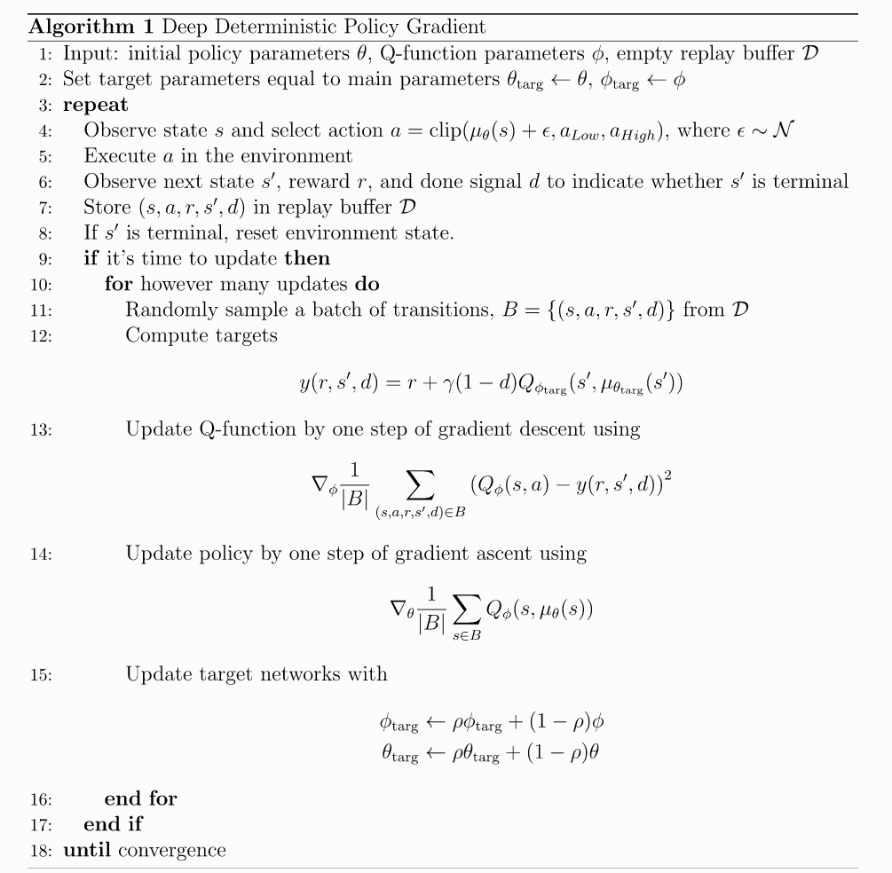
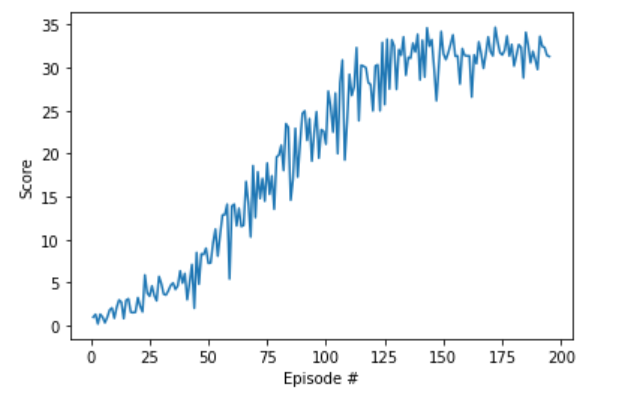
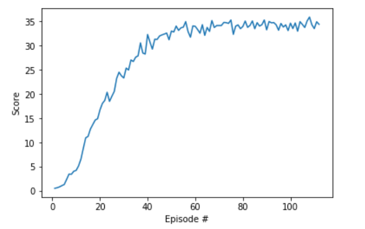
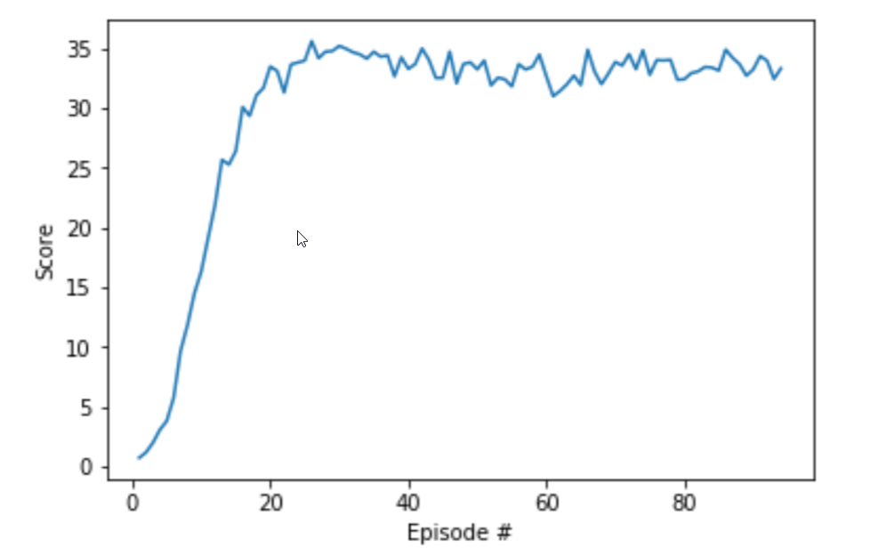

## PROJECT-2 Continious-Control
### 1- Pseudocode of the Employed Algorithm; DDPG
For detailed information about the algorithm see this link: https://spinningup.openai.com/en/latest/algorithms/ddpg.html#id1

	

 

### 2- Actor-Critic Networks and Tuned Hyperparameters
Actor Network:
- Number of nodes in first hidden layer: 256
- Number of nodes in Second hidden layer: 256
- Number of nodes in third hidden layer: 64
- Input: 33 (states)
- output: 4 (actions)  

Critic Network:
- Number of nodes in first hidden layer: 256
- Number of nodes in Second hidden layer: 128
- Number of nodes in third hidden layer: 32
- Input: 37 (states+actions)
- output: 1 (score)

Hyperparameters:
- buffer_size = 1e6
- batch_size = 128
- gamma: .90
- tau: .999
- lr_critic: 1e-4
- lr_actor: 1e-4
- max_t: 1000
- n_episodes: 500

### 3- Results:
I trained the agent with three different situations, all of which solved the problem (acheived average score 30 over last 100 episodes):

First trial: using environment v1, with one agent, and updated the actor/critic networks 5 times during each time step. This showed to be stable but it took quite some time for the agent to solve the problem. Next diagram shows the score per episode for this agent:

	

 

Second trial: I used environment 2, with 20 agents, and updated the critic/actor networks once during each time step plus 20 times after every 20 time steps. Score diagram is shown bellow:	

	

 

third trial: I used environment 2, with 20 agents, and updated the critic/actor networks 5 times every time step. This time agent was learning very fast (after 15 episodes, average score of all agents reached to 30), and it was quite stable. Score diagram is shown bellow:	

	

 

### 4- Future works to improve the agent:
- Testing other algorithms (such as A3C and PPO) as they might result in a better performance.
- Further turing hyperparameters and actor/critic networks.
- Using prioritized replay buffer.
